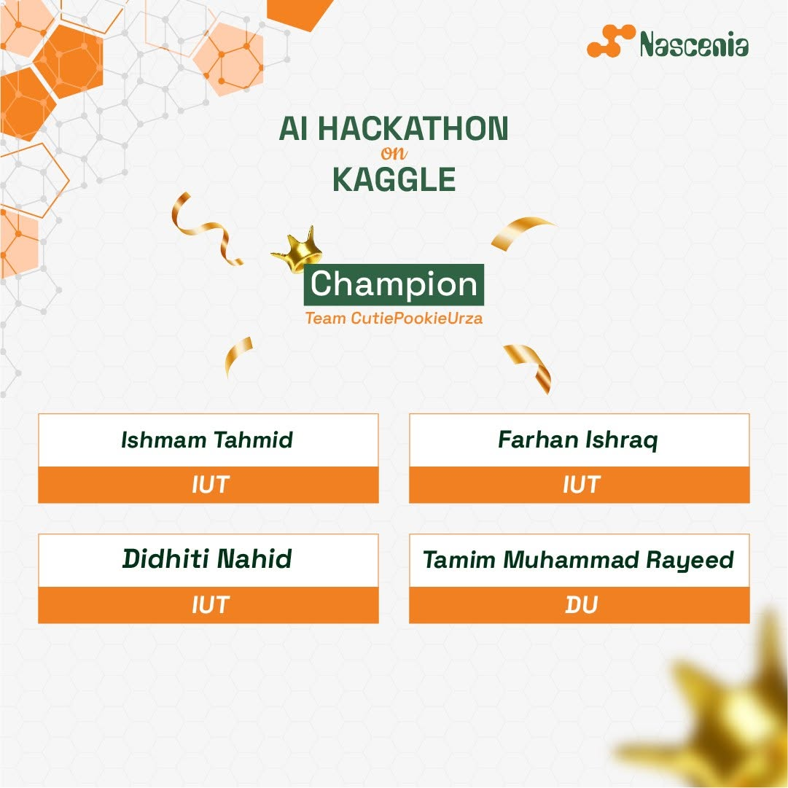
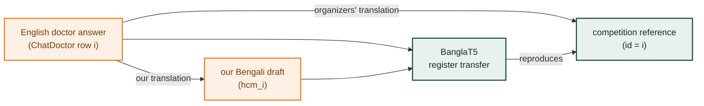
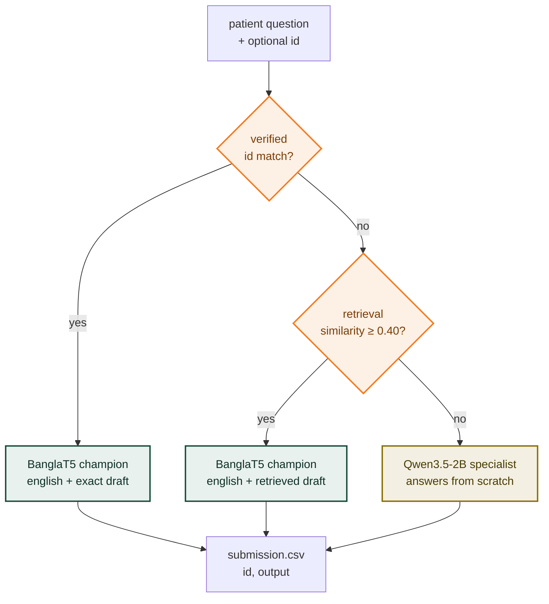

<div align="center">

# নাসেনিয়া ডক · Nascenia Doc

### Register-transfer generation for Bengali medical dialogue under a 3-billion-parameter budget

**নাসেনিয়া ডক** — *the clinician the corpus speaks as, and the voice the model had to learn*

**Champion — Nascenia AI Hackathon on Kaggle, 2026**

[](#4-leaderboard-journey)
[](#4-leaderboard-journey)
[](#3-the-final-system)
[](https://huggingface.co/csebuetnlp/banglat5)
[](https://huggingface.co/Qwen/Qwen3.5-2B)
[](#8-reproducing-the-results)

**Md. Farhan Ishraq**¹ · **Didhiti Nahid**¹ · **Tamim Muhammad Rayeed**² · **Ishmam Tahmid**¹

<sub>¹ Islamic University of Technology &nbsp;·&nbsp; ² University of Dhaka<br>
Team **CutiePookieUrza** · Kaggle community competition <a href="https://www.kaggle.com/competitions/nascenia-ai-hackathon"><code>nascenia-ai-hackathon</code></a> · July–August 2026</sub>

<br>



</div>

---

> Given a patient's message in **Bengali**, generate the doctor's reply — with
> **at most 3 billion parameters** at inference, counting every model in the pipeline.
>
> The competition was not decided by a better medical model. It was decided by
> reading the metric and then reading the data: the reference answers are one
> particular **translation** of a public English corpus, and the competition `id`
> is that corpus's **row index**. That reframes open-ended medical QA as
> **register transfer** — and moved the leaderboard by **+0.27**, more than every
> hyperparameter lever in the project combined.

<table>
<tr>
<td width="25%" align="center"><h3>0.89552</h3>public leaderboard — #1 for most of Phase 1, #3 at the close</td>
<td width="25%" align="center"><h3>0.89418</h3>private leaderboard, selected submission <code>55715906</code></td>
<td width="25%" align="center"><h3>2.13B</h3>total inference parameters — 871 M under the cap</td>
<td width="25%" align="center"><h3>1000/1000</h3>rows reproduced byte for byte by the organizers' notebook</td>
</tr>
</table>

| | |
|---|---|
| **Outcome** | Top-10 finalist → Phase 2, where the organizers re-run our notebook and an LLM judge scores it on their own private data |
| **Final system** | 3-way router: **BanglaT5** register-transfer *champion* (247,577,856) + **Qwen3.5-2B** *specialist* (1,881,825,088) = **2,129,402,944** parameters |
| **Reproducibility** | The final notebook regenerates the scored CSV byte for byte (sha256 `45a7ee592f7520bb…898aaa7e`) |
| **Phase 1 metric** | `0.5·BERTScore + 0.3·Token-F1 + 0.2·ROUGE-L`; final score `0.8 × Phase 1 + 0.2 × Phase 2` |

---

## Contents

**The argument**
&nbsp;&nbsp;[1. The task](#1-the-task) ·
[2. The finding that decided the competition](#2-the-finding-that-decided-the-competition) ·
[3. The final system](#3-the-final-system)

**The evidence**
&nbsp;&nbsp;[4. Leaderboard journey](#4-leaderboard-journey) ·
[5. What worked, and what we closed by measurement](#5-what-worked-and-what-we-closed-by-measurement)

**The code**
&nbsp;&nbsp;[6. Repository layout](#6-repository-layout) ·
[7. Where to read what](#7-where-to-read-what) ·
[8. Reproducing the results](#8-reproducing-the-results) ·
[9. Data, models and licences](#9-data-models-and-licences) ·
[10. Kaggle artifacts](#10-kaggle-artifacts) ·
[11. Hard-won lessons](#11-hard-won-lessons) ·
[12. Old path → repo path](#12-old-path--repo-path)

---

## 1. The task

| | |
|---|---|
| Input → output | Bengali patient prompt → Bengali doctor response |
| Data | `train.csv` 108,954 rows (`id,input,output`) · `test.csv` 1,000 rows (`id,input`) |
| Submission | `id,output`, one row per test id |
| Hard cap | **≤ 3B parameters at inference** — base + adapters + every ensemble member |
| Final score | `0.8 × Phase 1 + 0.2 × Phase 2` |
| Phase 1 metric | `0.5·BERTScore + 0.3·Token-F1 + 0.2·ROUGE-L` on the hidden test split |
| Phase 2 | Top 10 only: the organizers re-run the inference notebook (reproduction + parameter check), then an LLM judge scores clinical accuracy, tone, completeness and clarity on **their own held-out data** |

Full rules: [COMPETITION_RULES.md](COMPETITION_RULES.md) (the Kaggle pages take precedence over [Rulebook_Nascenia.pdf](Rulebook_Nascenia.pdf)).

**Early measurements that shaped everything** ([PLAN.md](PLAN.md), [LOCAL_EXPERIMENTS.md](LOCAL_EXPERIMENTS.md)):

- `train.csv` is **Bengali-translated ChatDoctor / HealthCareMagic-100k** with the brand find-replaced to `নাসেনিয়া ডক` (incompletely — `01_prep.py` finishes the job).
- 76% of reference answers start with `হেলো`; boilerplate is a large, free share of lexical overlap.
- BERTScore barely separates a random answer from a generic one (0.012), so **Token F1 and ROUGE-L decide the leaderboard**. A single hand-written constant string took **#1 on day 1 (0.57849)** and beat every fine-tuned entry.
- Retrieval (0.2047 Token F1) lost to that constant (0.2669): confident-but-wrong specifics cost more precision than they gain recall.

## 2. The finding that decided the competition

**ALIGN-01 (5 Aug).** The competition `id` (0–112,164, unique across train and test) is **the row index of ChatDoctor/HealthCareMagic-100k**. Our own Bengali translation of that public corpus ([github.com/Kent0n-Li/ChatDoctor](https://github.com/Kent0n-Li/ChatDoctor), translated with Google Translate) is keyed `hcm_<row index>`, so **all 1,000 test ids resolve**. Every test question therefore has two independent views of the *same* doctor answer: the English original and our own Bengali translation.



That turns the task from open-ended medical QA into **register transfer**: `English source + our Bengali draft → the organizers' Bengali wording`.

| prediction source | Token F1 | ROUGE-L | public LB |
|---|---|---|---|
| best question→answer fine-tune (BanglaT5, arm C) | 0.2576 | 0.1776 | *pred.* 0.5800 |
| constant string | 0.2669 | 0.1564 | 0.57849 |
| raw draft + brand/greeting regex *(lookup — not allowed as a submission)* | 0.5984 | 0.5482 | *pred.* 0.7564 |
| **register-transfer model, day 1** | **0.7724** | **0.7324** | **0.85030** |
| **final champion** | **0.8348** | **0.8061** | **0.89552** |

A raw lookup is not model output (Rules §8) and cannot be reproduced as a model in Phase 2, so the legal form is a **model trained on the transfer**. The source is public, free and ungated (Rules §2.6.a), and the use was disclosed to the organizers. Details: **ALIGN-01** in [LOCAL_EXPERIMENTS.md](LOCAL_EXPERIMENTS.md) and the 2026-08-05 entry in [PROGRESS.md](PROGRESS.md).

## 3. The final system

The champion restyles a draft brilliantly but **cannot answer without one** (Token F1 0.1235 — it echoes the patient back). Phase 2 is judged on the organizers' private data, where the ChatDoctor id lookup resolves on **0%** of rows. So the Phase 2 deliverable adds a second model that genuinely answers, and a router that sends every row to exactly one model:



| | Champion | Specialist |
|---|---|---|
| Base | [`csebuetnlp/banglat5`](https://huggingface.co/csebuetnlp/banglat5) (seq2seq) | [`Qwen/Qwen3.5-2B`](https://huggingface.co/Qwen/Qwen3.5-2B) (decoder) |
| Parameters | 247,577,856 | 1,881,825,088 |
| Training data | 101,737 aligned pairs: `english + draft → target`, 768/512 tokens | competition 101,740 + iCliniq 7,321 (arm **D1**), `question → answer` |
| Recipe | full fine-tune · Adafactor · lr 1e-3 · warmup 200 · effective batch 64 · seed 11 · bf16 · 30k-step budget, peak at **12,000** | full fine-tune · prompt-masked loss · Bengali system prompt · Adafactor · lr 2e-5 cosine · warmup 300 · effective batch 64 · seed 42 · bf16 · 1024/640, peak at **2,500** |
| Shipped weights | `ckptavg_peak5` — uniform average of checkpoints 11,500–12,500 of that one run | best checkpoint (selected on generated Token F1, never loss) |
| Decoding | beam 8 · length penalty 1.2 · `min_new_tokens` 0 · `max_new_tokens` 320 · **fp32** · normalized input | beam 4 · length penalty 1.0 · bf16 · raw input |
| Runtime stack | `transformers==4.57.3` (subprocess) | `transformers==5.14.1` (kernel) |
| Dev / held-out | Token F1 **0.8348** · ROUGE-L **0.8061** (dev-300) | Token F1 **0.2625** (held-out n=1000) vs 0.1235 for the champion without a draft |

Both routing gates use zero-parameter char-n-gram TF-IDF, and both fail safe towards the specialist:

- **Id gate.** The corpus key is a bare row index, so any file with small integer ids would collide. The notebook samples the hits and checks their *questions* against the rows they claim to be (median match 0.474 for genuine ids vs 0.047 for coincidental ones), and disables branch 1 for the whole file if the check fails.
- **Retrieval gate.** On 362 held-out rows whose ids do not resolve, champion + retrieved draft scores **0.6257** vs **0.2616** for the specialist. Quality rises monotonically with similarity, and the 0.40 threshold sits where every bucket above it wins decisively.

Two `transformers` versions are required and isolated on purpose: 4.57 ties BanglaT5's `shared`/`lm_head` weights and 5.x does not, and Qwen3.5 does not exist in 4.57. The champion also runs in **fp32**, because bf16 decoded 280 of 1,000 rows differently under beam 8.

Write-up submitted to the organizers: [PHASE2_WRITEUP.md](PHASE2_WRITEUP.md) (it describes the two-branch bundle; the retrieval branch and id verification were added afterwards and are documented in [PHASE2_EMAIL_DRAFT.md](PHASE2_EMAIL_DRAFT.md) and the final notebook).

## 4. Leaderboard journey

| date | submission | dev Token F1 / ROUGE-L | public LB | what changed |
|---|---|---|---|---|
| 08-04 | constant string (probe) | 0.2669 / 0.1564 | **0.57849** | hand-written boilerplate — took #1 and exposed how the metric behaves |
| 08-05 | best question→answer BanglaT5 (arm C) | 0.2576 / 0.1776 | *pred.* 0.5800 | seven-arm Kaggle sweep; lr 1e-3 optimal, then closed |
| 08-06 | register transfer, seed 11 | 0.7724 / 0.7324 | **0.85030** | **ALIGN-01** — +0.272 over the constant |
| 08-06 | 2-seed notebook (MBR lost, shipped seed-23 beam) | 0.7723 / 0.7332 | **0.85088** | MBR measured: −0.0027 |
| 08-10 | E05 `english_draft`, 12,000 steps | 0.8257 / 0.7968 | **0.88008** | read the English source + train 4.4× longer |
| 08-10 | + E15 decoder | 0.8328 / 0.8039 | **0.89347** | beam 8, lp 1.2, dropped a stale `min_new_tokens 80` |
| 08-14 | E14 weight soup (champion + one E19 seed) | 0.8345 / 0.8061 | **0.89532** | weight averaging across runs |
| 08-14 | **E15 `ckptavg_peak5`** | **0.8348 / 0.8061** | **0.89552** | average the champion's *own* 5 checkpoints around its peak |
| 08-23 | final selected submission (router notebook) | — | **0.89552** · private **0.89418** | byte-identical output from the Phase 2 notebook |

Implied organizer BERTScore (solved from the deterministic lexical terms): 0.9343 → 0.9442 → **0.9677**. It barely moved at first, jumped once the forced padding was removed, then plateaued. See [PREDICTIONS.md](PREDICTIONS.md) for every dev↔LB pair and the calibrated predictors.

## 5. What worked, and what we closed by measurement

**Worked**

| lever | gain | evidence |
|---|---|---|
| Register transfer instead of QA (ALIGN-01) | +0.27 LB | [LOCAL_EXPERIMENTS.md](LOCAL_EXPERIMENTS.md) ALIGN-01, XFER |
| Train to convergence | peak at 12,000–15,250 steps, not 2,750 | [E05](notebooks/chpc_experiments/E05_train_to_convergence/RESULTS.md) |
| Feed the English source | +0.0220 Token F1 (the Bengali draft adds only +0.0053 on top of English) | [E01/E04](notebooks/chpc_experiments/RESULTS.md), [REPORT.md](REPORT.md) §2.2 |
| Fix the decoder (drop `min_new_tokens 80`, beam 8, lp 1.2) | +0.0134 LB, a third of it BERTScore | [E15](notebooks/chpc_experiments/E15_decode_sweep/RESULTS.md) |
| Average the run's own checkpoints around the peak | +0.0020 LB for zero training | [E15](notebooks/chpc_experiments/E15_decode_sweep/RESULTS.md) |
| fp32 + pinned `transformers` for the champion | 1000/1000 byte-identical reproduction | [PROGRESS.md](PROGRESS.md) 08-23 |
| Fine-tuned specialist for unseen questions | 0.2625 vs 0.1235 Token F1 | [Phase 2 results](notebooks/phase2_specialist/B_Qwen35_2B/RESULTS.md) |
| Retrieval branch into a broad consultation corpus | 0.6257 vs 0.2616 on unresolvable rows | [PROGRESS.md](PROGRESS.md) 08-23 (later) |

**Closed by measurement** — each with its own record, so nobody walks the same dead end twice:

| idea | result |
|---|---|
| MBR decoding | −0.0027 LB (task is near-deterministic) |
| Output ensembling across 6 diverse members | +0.0020, inside noise, despite a +0.0326 oracle ceiling |
| 10-seed weight soup | *worse* than the best single seed |
| A better translator for the draft (E17) | Claude +0.0631 on draft quality but −0.0060 after transfer; Qwen3-14B −0.1255; NLLB-200 −0.0439 |
| Decoder-only models on the transfer task (E18) | best was Gemma-2-2B at 0.8068 vs BanglaT5 0.8328 — tokenizer handicap 2–5× |
| mT5-base | 0.8017, and 27.9% truncated answers (references: 6.8%) |
| IndicBART | 0.44 |
| Distilling from a large teacher (E20) | Qwen3.5-9B few-shot scored 0.5841 — the gate failed |
| Warm-start / multitask Q→A / label smoothing | +0.0028 / −0.022 / +0.0039 (noise) |
| RAG for the specialist | loses when trained in; bolted on, it copies the retrieved case |
| Extra external data | ai-medical-chatbot off-register (`হাই` 70% vs `হেলো` 76%); translated exam MCQs damaged clinical detail |
| Qwen2.5-3B / Llama-3.2-3B as a hedge | 3.09B / 3.21B total parameters — **over the cap** despite the name |

The seed-to-seed noise floor was measured at **0.0044 Token F1**; anything below it is treated as a tie.

## 6. Repository layout

```
.
├── README.md                     ← you are here
├── PROGRESS.md                   chronological journal (newest first) — start here to catch up
├── REPORT.md                     GPU experiment-program report (08-11 snapshot, updated header)
├── PHASE2_WRITEUP.md             Phase 2 write-up submitted to the organizers
├── PHASE2_EMAIL_DRAFT.md         Phase 2 handover: notebook, datasets, how to run, selection proof
├── PLAN.md                       strategy as it evolved — including its retractions
├── LOCAL_EXPERIMENTS.md          every run: config, all metric components, verdict
├── PREDICTIONS.md                dev ↔ leaderboard table and calibrated predictors
├── FINE_TUNING_LOG.md            Kaggle-era training log (Q→A sweep, first transfer runs)
├── CLAUDE.md                     project working memory: rules, traps, settled decisions
├── GPT-INSTRUCTIONS.md           condensed briefing for other assistants (08-07)
├── GPT_DATASET_FIND.md           external-data fitness audit
├── DATASETS.md                   short data / model / tool disclosure (Phase 2)
├── COMPETITION_RULES.md          rules, transcribed from Kaggle
├── Rulebook_Nascenia.pdf         organizer rulebook (background; Kaggle governs)
├── MODEL_LIST.md                 day-1 candidate model list
│
├── notebooks/                    every Kaggle / cluster notebook — index: notebooks/README.md
│   ├── phase1_kaggle_training/   T4 training: seed runs, Q→A sweep A–G, register transfer, mT5
│   ├── phase1_submissions/       scored + candidate submissions, 0.57849 → 0.89552
│   ├── phase1_probes/            MBR, decode sweep, ALIGN-01 probe, translator probes, XFER-TEST24
│   ├── chpc_experiments/         E01–E24 GPU program: spec + results + notebook + run records
│   ├── phase2_specialist/        Phase 2 model study: mT5-base / Qwen3.5-2B / Bangla-AI-1.7B
│   └── phase2_submissions/       router notebooks, diagnostics, and the FINAL organizer notebook
│
├── scripts/                      every script — index: scripts/README.md
│   ├── pipeline/                 prep · train (T5 + causal) · decode · metric · builders · soup
│   ├── analysis/                 early EDA, baselines, constant optimiser, corpus curation
│   ├── kaggle/                   guarded push tool, nascenia-code snapshot, notebook generators
│   ├── chpc_slurm/               SLURM registry/submitter, 100+ job scripts, pool runners
│   ├── phase2/                   Phase 2 data/index builders and router validators
│   ├── phase2_bundle/            the offline repro pack: run_bundle.sh, envs, Dockerfile, manifest
│   └── e17_draft_quality/        translator bake-off runner and scorer
│
└── datasets/                     documentation only — no data is committed
    ├── README.md                 every dataset: link, licence, size, and what we did with it
    └── …                         original audit / translation / curation notes
```

**Not in git, on purpose:** model weights (Kaggle datasets, see §10), all datasets (see [datasets/README.md](datasets/README.md)), per-arm prediction dumps and cluster logs. The only CSVs kept are the three scored submissions, as immutable evidence.

## 7. Where to read what

| question | read |
|---|---|
| What happened, in order? | [PROGRESS.md](PROGRESS.md) |
| Why was a decision made, and what was retracted? | [PLAN.md](PLAN.md) |
| What exactly did run *X* score? | [LOCAL_EXPERIMENTS.md](LOCAL_EXPERIMENTS.md) · [FINE_TUNING_LOG.md](FINE_TUNING_LOG.md) |
| How does dev map to the leaderboard? | [PREDICTIONS.md](PREDICTIONS.md) |
| What did the GPU program find? | [REPORT.md](REPORT.md) · [notebooks/chpc_experiments/](notebooks/chpc_experiments/README.md) |
| How does the Phase 2 system work, and what data does it use? | [PHASE2_WRITEUP.md](PHASE2_WRITEUP.md) · [PHASE2_EMAIL_DRAFT.md](PHASE2_EMAIL_DRAFT.md) · [notebooks/phase2_specialist/](notebooks/phase2_specialist/README.md) |
| Which traps cost us time? | [CLAUDE.md](CLAUDE.md) → "Traps already hit" |
| Where did each dataset come from? | [datasets/README.md](datasets/README.md) |
| Which notebook / script does what? | [notebooks/README.md](notebooks/README.md) · [scripts/README.md](scripts/README.md) |

## 8. Reproducing the results

### 8.1 The final system on Kaggle (simplest)

Open [`farhanishraqq/cpu-final-submission`](https://www.kaggle.com/code/farhanishraqq/cpu-final-submission) (private — needs access to its five input datasets), keep **Internet on** and a **T4 GPU**, and *Run All*. It is pre-pointed at the competition test set and should print `ID_LOOKUP 1000 (100.0%)`, `COMBINED 2,129,402,944`, and write a `submission.csv` with sha256 `45a7ee59…aa7e`. To score new data, change only `INPUT_PATH` in cell 1. Source: [notebooks/phase2_submissions/09_cpu_final_submission_FINAL/](notebooks/phase2_submissions/09_cpu_final_submission_FINAL/).

### 8.2 Offline, with the repro pack

```bash
cd scripts/phase2_bundle
./env/setup_envs.sh                  # two venvs: transformers 4.57.3 and 5.14.1 (or build env/Dockerfile)
./env/verify_envs.sh                 # ~30 s: versions, GPU, real-tensor parameter count vs the 3B cap
P2_ENV_CHAMPION=<env> P2_ENV_SPECIALIST=<env> ./scripts/run_bundle.sh <test.parquet> <out.csv>
```

It needs `weights/` (the two Kaggle model datasets) and `lookup/` next to `scripts/`. See [scripts/phase2_bundle/README.md](scripts/phase2_bundle/README.md). `torch==2.8.0+cu128` is not on plain PyPI, so set `PIP_EXTRA_INDEX_URL=https://download.pytorch.org/whl/cu128`.

### 8.3 Retrain the champion

```bash
pip install "transformers==4.57.3" torch pandas pyarrow sentencepiece protobuf
pip install git+https://github.com/csebuetnlp/normalizer
python scripts/pipeline/metric.py --selftest                     # LCS vs brute force

# 1. frozen split (seed 42, 5,000 dev rows) from the competition CSVs
python scripts/pipeline/01_prep.py --raw <dir with train.csv, test.csv> --out <proc>
# 2. english + draft inputs (needs the ChatDoctor English corpus and our Bengali translation)
python scripts/pipeline/09_build_inputs.py --fields en,bn \
  --english unified_medical_qa_train.csv --bengali bengali_medical_train_clean.csv \
  --proc <proc> --out <english_draft>
# 3. train — exact invocation: scripts/chpc_slurm/nasc-E05-english_draft.sbatch
python scripts/pipeline/02_train_t5.py --data-dir <english_draft> --model csebuetnlp/banglat5 \
  --out-dir . --run-name english_draft --seed 11 --lr 0.001 --warmup 200 --optim adafactor \
  --max-source-len 768 --max-target-len 512 --batch-size 32 --grad-accum 2 --eval-batch-size 32 \
  --eval-subset 300 --eval-steps 250 --max-steps 30000 --save-total-limit 0 \
  --early-stopping-patience 8 --gen-num-beams 4 --gen-min-new-tokens 80 \
  --precision auto --no-group-by-length --resume
# 4. average the five checkpoints around the peak
python scripts/pipeline/17_model_soup.py english_draft/ckpt/checkpoint-{11500,11750,12000,12250,12500} \
  --out ckptavg_peak5 --data-dir <english_draft>
# 5. decode with the shipped decoder
python scripts/pipeline/04_decode.py --ckpt ckptavg_peak5 --data-dir <english_draft> --split test \
  --mode beam --num-beams 8 --length-penalty 1.2 --min-new-tokens 0 --max-new-tokens 320 \
  --max-source-len 768 --out submission.csv
```

Judge runs on **Token F1 and ROUGE-L**; the local composite uses a stand-in BERTScore model and is offset from the leaderboard (see [PREDICTIONS.md](PREDICTIONS.md)). Weight hashes differ between identical runs; **decoded outputs are the reproduction evidence.**

### 8.4 Retrain the specialist

Build the data with [`scripts/phase2/shared/build_data.py`](scripts/phase2/shared/build_data.py), then train with [`scripts/pipeline/03_train_causal.py`](scripts/pipeline/03_train_causal.py) following [`notebooks/phase2_specialist/B_Qwen35_2B/INSTRUCTIONS.md`](notebooks/phase2_specialist/B_Qwen35_2B/INSTRUCTIONS.md) (arm **D1** = `plain_core_plus_icliniq`). The shipped arm's full config is [`scripts/phase2_bundle/docs/shipped_arm_run.json`](scripts/phase2_bundle/docs/shipped_arm_run.json).

## 9. Data, models and licences

Full catalogue with links and processing notes: **[datasets/README.md](datasets/README.md)**. In short:

| data | rows | role |
|---|---|---|
| Competition `train.csv` / `test.csv` (CC BY-NC 4.0) | 108,954 / 1,000 | targets; frozen split 101,740 train / 5,000 dev |
| ChatDoctor HealthCareMagic-100k — English + **our** Bengali translation (research-only) | 112,154 → 107,737 aligned pairs | champion inputs (`english + draft`) |
| ChatDoctor iCliniq — our Bengali translation (research-only) | 7,321 | specialist training (D1) |
| ai-medical-chatbot — our Bengali translation | 166,193 | retrieval corpus for router branch 2 (not trained on) |

| model | params | licence | role |
|---|---|---|---|
| [csebuetnlp/banglat5](https://huggingface.co/csebuetnlp/banglat5) | 247,577,856 | CC BY-NC-SA 4.0 | **shipped** champion |
| [Qwen/Qwen3.5-2B](https://huggingface.co/Qwen/Qwen3.5-2B) | 1,881,825,088 | Apache-2.0 | **shipped** specialist |
| [csebuetnlp/normalizer](https://github.com/csebuetnlp/normalizer) | — | open source (pinned `d405944`) | champion text preprocessing |
| google/mt5-base · swapnillo/Bangla-AI-1.7B · Gemma-2-2B-IT · Qwen3 / Qwen2.5 / Qwen3.5-0.8B · IndicBART | — | — | evaluated, not shipped (E08, E18, Phase 2 arms A/C) |
| intfloat/multilingual-e5-base | ~278M | MIT | RAG ablations only — not in the pipeline |

⚠️ **Use restrictions.** The competition data is non-commercial, BanglaT5 is CC BY-NC-SA, and ChatDoctor data is *"for academic research only; commercial and clinical use prohibited."* This work is a competition entry and research artifact, **not a medical device**; the pipeline must not be deployed commercially or clinically. The licence reasoning for the competition's winner-licensing rule is in [PHASE2_WRITEUP.md](PHASE2_WRITEUP.md) §5. No licence has been chosen for this repository's own code yet.

## 10. Kaggle artifacts

All are **private** to the team; the organizers were given access for Phase 2.

| notebook | what |
|---|---|
| [`farhanishraqq/cpu-final-submission`](https://www.kaggle.com/code/farhanishraqq/cpu-final-submission) | 🏁 final Phase 2 notebook (router) — produced the selected 0.89552 submission |
| [`farhanishraqq/nascenia-peak5-inference`](https://www.kaggle.com/code/farhanishraqq/nascenia-peak5-inference) | champion-only inference, 0.89552 |
| [`farhanishraqq/nascenia-e05-inference`](https://www.kaggle.com/code/farhanishraqq/nascenia-e05-inference) | 0.89347 |
| [`didhitinahid/nascenia-submit-xfer-s11`](https://www.kaggle.com/code/didhitinahid/nascenia-submit-xfer-s11) | first register-transfer submission, 0.85030 |
| [`farhanishraqq/nascenia-constant-probe`](https://www.kaggle.com/code/farhanishraqq/nascenia-constant-probe) | day-1 constant probe, 0.57849 |

| dataset | contents |
|---|---|
| `farhanishraqq/nascenia-peak5-checkpoint-average` | champion weights |
| `farhanishraqq/nascenia-phase2-qwen35-d1` | specialist weights |
| `farhanishraqq/nascenia-router-corpus` | id-resolution corpus (English + draft by ChatDoctor row) |
| `farhanishraqq/nascenia-aimc-lookup` | retrieval corpus (branch 2) |
| `farhanishraqq/nascenia-phase2-repro-pack` | this repo's `scripts/phase2_bundle/` + lookup + verification CSVs |

The full list (checkpoints, code snapshots, probe data, per-account copies) is in [datasets/README.md](datasets/README.md#5-kaggle-datasets-built-by-the-team). Compute came from several team Kaggle accounts (single T4, fp32) for the early runs and all submissions, and from the CHPC clusters granite / notchpeak (H100 NVL, H200, A800, L40S, A6000) for the ~60-arm experiment program and the Phase 2 model study.

## 11. Hard-won lessons

Each of these cost real GPU hours. The full list, with root causes, is under "Traps already hit" in [CLAUDE.md](CLAUDE.md) and in [REPORT.md](REPORT.md) §5.

1. **Pin `transformers==4.57.3` and assert it.** Kaggle's 5.0.0 produced loss ~163, untied embeddings and silent stalls — one root cause that looked like five bugs.
2. **Never fp16 with T5.** It overflows to NaN *silently* and still writes a well-formed CSV of garbage. Every inference notebook asserts a known dev number before writing.
3. **`"machine_shape": "NvidiaTeslaT4"` or no push.** Without it Kaggle hands out a P100 that its own PyTorch cannot run ([`scripts/kaggle/kpush.py`](scripts/kaggle/kpush.py) enforces this).
4. **Select checkpoints on generated metrics, never on loss.** One run's lowest loss was its worst Token F1.
5. **Budget in steps, and look at the whole trajectory.** The first transfer model was under-trained by 4.4× and nobody noticed until the curve was plotted.
6. **A model named "3B" is not ≤ 3B.** Check total parameters, and assert them from the real tensors at inference.
7. **Outputs, not weight hashes, prove reproduction.** Identical configs gave identical text from bitwise-different weights.
8. **A resolving id is not proof of a match.** A bare row-index key collides with any small-integer id column, so verify at the dataset level.
9. **Name UTF-8 everywhere.** Windows cp1252 consoles and `LC_ALL=C` batch nodes both crash on Bengali.
10. **"No overlap" needs the right comparison.** Two datasets that share a source must be compared by identifier space, not exact strings — that is how ALIGN-01 was nearly missed.

## 12. Old path → repo path

The journals quote paths from the original working tree. They map as follows:

| working-tree path | in this repo |
|---|---|
| `NOTEBOOKS/*.py` (analysis) · `NOTEBOOKS/0.*_…/` | `scripts/analysis/` · `notebooks/phase1_submissions/` |
| `NOTEBOOKS/_inference_notebooks/`, `KAGGLE_PUSH/<kernel>/` | `notebooks/phase1_submissions/`, `notebooks/phase1_probes/`, `notebooks/phase2_submissions/` |
| `FINE_TUNING_NOTEBOOKS/N) …/` | `notebooks/phase1_kaggle_training/NN_…/` (weights not included) |
| `KAGGLE_PUSH/kpush.py`, `KAGGLE_PUSH/code_dataset*/` | `scripts/kaggle/kpush.py`, `scripts/kaggle/nascenia-code/` |
| `fine_tune_project/code/` | `scripts/pipeline/` |
| `fine_tune_project/_slurm/` | `scripts/chpc_slurm/` (analysis reports: `notebooks/chpc_experiments/_analysis/`) |
| `fine_tune_project/E*/` | `notebooks/chpc_experiments/E*/` (specs, results, notebooks, run records; no checkpoints) |
| `fine_tune_project/reference_notebooks/` | byte-identical copies are in `notebooks/phase1_kaggle_training/` |
| `fine_tune_project/data/`, `DATA/` | not uploaded — documented in `datasets/` |
| `fine_tune_project/E15_decode_sweep/ckptavg_peak5/` | weights: Kaggle `farhanishraqq/nascenia-peak5-checkpoint-average` |
| `Phase2 Final architecture/` | `notebooks/phase2_specialist/` + `scripts/phase2/` |
| `PHASE2_BUNDLE_latest/PHASE2_BUNDLE/` | `scripts/phase2_bundle/` (+ `PHASE2_WRITEUP.md` at the root) |
| `FINAL SUBMISSION_DRAFT/` | `notebooks/phase1_submissions/08_peak5_inference_LB0.89552/` |
| `RULEBOOK/`, `MODELS/` | repo root |
| `PHASE_2_EXP/` (mentioned in older notes) | superseded by `notebooks/phase2_specialist/` |
---

<div align="center">

### Further reading

[**Journal**](PROGRESS.md) &nbsp;·&nbsp;
[**Strategy**](PLAN.md) &nbsp;·&nbsp;
[**Experiments**](LOCAL_EXPERIMENTS.md) &nbsp;·&nbsp;
[**GPU report**](REPORT.md) &nbsp;·&nbsp;
[**Predictions**](PREDICTIONS.md) &nbsp;·&nbsp;
[**Phase 2 write-up**](PHASE2_WRITEUP.md) &nbsp;·&nbsp;
[**Datasets**](datasets/README.md)

---

*Every number in this repository was measured, and every dead end is written
down next to the result that closed it. The negative results are the point: they
are what stops the same ground being walked twice.*

---

**Acknowledgements.** Nascenia, for organising the competition and for keeping
the leaderboard honest; csebuetnlp, for BanglaT5 and the Bengali normalizer; the
ChatDoctor authors, for releasing their corpus; the Qwen team; and the CHPC
clusters granite and notchpeak, which ran the ~60-arm experiment program.

---

<sub>This work is a competition entry and a research artifact — **not a medical
device**. The competition data is CC BY-NC 4.0, BanglaT5 is CC BY-NC-SA 4.0, and
the ChatDoctor corpora are released for academic research only, with commercial
and clinical use prohibited. The pipeline must not be deployed commercially or
clinically, and nothing it generates is medical advice.</sub>

<sub>Nascenia AI Hackathon on Kaggle · Team CutiePookieUrza · farhanishraq17@iut-dhaka.edu</sub>

</div>
