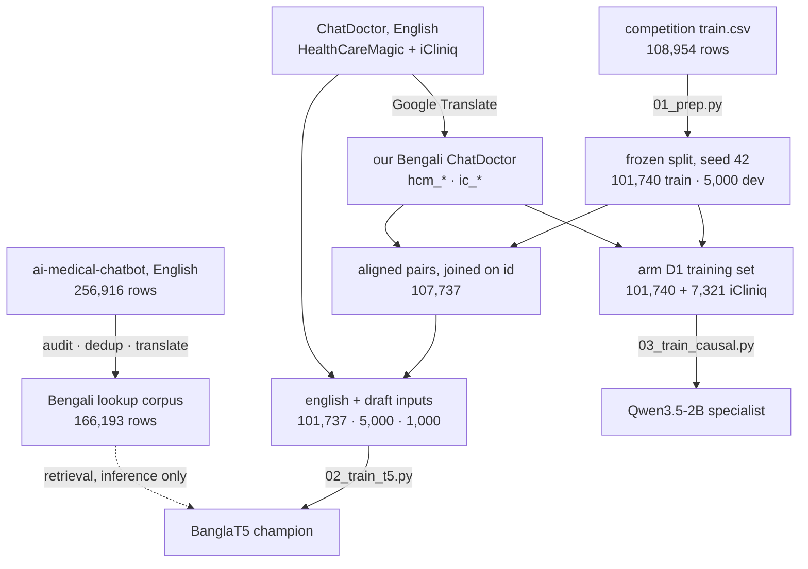

# Datasets

**No data is committed to this repository.** This folder documents every dataset the project touched: where it comes from, its licence, its size, and exactly what we did with it. The sub-folders hold the original audit, translation and curation notes, kept verbatim.

| § | section |
|---|---|
| 1 | [Data flow of the shipped system](#1-data-flow-of-the-shipped-system) |
| 2 | [Datasets used by the shipped models](#2-datasets-used-by-the-shipped-models) |
| 3 | [Datasets built, translated or evaluated but not shipped](#3-datasets-built-translated-or-evaluated-but-not-shipped) |
| 4 | [Datasets surveyed and rejected](#4-datasets-surveyed-and-rejected) |
| 5 | [Kaggle datasets built by the team](#5-kaggle-datasets-built-by-the-team) |
| 6 | [Papers](#6-papers) |
| 7 | [Tools](#7-tools) |
| 8 | [Notes in this folder](#8-notes-in-this-folder) |

---

## 1. Data flow of the shipped system

The frozen split is the backbone of every number in the project: `01_prep.py --seed 42 --dev-size 5000` ([report](PROCESSED/prep_report.txt)). Dev rows (and every translated copy of a dev answer) are **never** trained on, and each builder re-asserts that at runtime.

## 2. Datasets used by the shipped models

| dataset | link | licence | size | what we did |
|---|---|---|---|---|
| **Nascenia AI Hackathon** `train.csv` / `test.csv` | [Kaggle data tab](https://www.kaggle.com/competitions/nascenia-ai-hackathon/data) | CC BY-NC 4.0 | 108,954 / 1,000 rows · `id,input,output` | Finished the organizers' incomplete brand replacement (`চ্যাটডক্টর` / `ChatDoctor` → `নাসেনিয়া ডক`: 3,213 outputs, 250 inputs, 1,438 Latin), NFC + whitespace, dropped 2,214 degenerate rows (input < 10 or output < 15 tokens), frozen seed-42 split → **101,740 train / 5,000 dev**. Found that `id` is a ChatDoctor row index (**ALIGN-01**). |
| **ChatDoctor — HealthCareMagic-100k** (English originals) | [Kent0n-Li/ChatDoctor](https://github.com/Kent0n-Li/ChatDoctor) · HF mirror [lavita/ChatDoctor-HealthCareMagic-100k](https://huggingface.co/datasets/lavita/ChatDoctor-HealthCareMagic-100k) | code Apache-2.0; data *"academic research only — commercial and clinical use prohibited"* | 112,165 rows | Used as the **English input field** of the champion (`unified_medical_qa_train.csv`, 126,792 rows across ChatDoctor sources). Joined to competition ids by row index. |
| **Our Bengali translation of ChatDoctor** (HealthCareMagic part) | derived by the team from the repo above | same terms as ChatDoctor; our translation | 112,154 rows (`hcm_<row index>`) → **107,737 aligned pairs** | Translated EN→BN with Google Translate (`client=gtx`, 20 threads, 1,200-char chunks, retry backoff, zero-width/code-symbol cleanup, digit transliteration). Joined to competition ids → `aligned_pairs.csv` (`comp_id · split · draft · target`), 100% dev/test coverage. The **draft** input of the champion. Byte-identical across `Data_Search_3` and `Data_Search_5`. |
| **ChatDoctor — iCliniq** (our Bengali translation) | same repo · HF subset `chatdoctor_icliniq` of [Malikeh1375/medical-question-answering-datasets](https://huggingface.co/datasets/Malikeh1375/medical-question-answering-datasets) | same terms as ChatDoctor | 7,321 rows (`ic_*`) | Same translation pass (consistent fingerprint). Added to the competition rows to train the **specialist** (arm D1, 109,061 rows). Covered by the competition's exception for input data with an incompatible licence — reasoning in [PHASE2_WRITEUP.md](../PHASE2_WRITEUP.md) §5. Fallback arm X4 uses no external data and ties D1. |
| **AI Medical Chatbot** | [ruslanmv/ai-medical-chatbot](https://huggingface.co/datasets/ruslanmv/ai-medical-chatbot) · Kaggle repack [yousefsaeedian/ai-medical-chatbot](https://www.kaggle.com/datasets/yousefsaeedian/ai-medical-chatbot) | Apache-2.0 as declared on Kaggle; original producers not identified | 256,916 English rows | Audited ([notes](Data_Search_4/SOURCES.md)): removed 10,390 duplicate pairs and **81,170 rows whose patient text already appears in ChatDoctor**, kept one answer per question → 166,427; translated → 166,193 Bengali rows. **Not trained on** (off-register: opens `হাই`/`হ্যালো` 70% vs the references' `হেলো` 76%). Used **only at inference** as the zero-parameter TF-IDF retrieval corpus for router branch 2. |

## 3. Datasets built, translated or evaluated but not shipped

| dataset | link | licence | size | what we did / why it was not shipped |
|---|---|---|---|---|
| GenMedGPT-5k | distributed with [ChatDoctor](https://github.com/Kent0n-Li/ChatDoctor) | ChatDoctor terms | 5,452 → 5,200 | Translated. Phase 2 ablation arm D2 and the E12 warm-start corpus. Very short answers (median 31 words) and off-register. |
| doctor_qa_bangla | [shetumohanto/doctor_qa_bangla](https://huggingface.co/datasets/shetumohanto/doctor_qa_bangla) | Apache-2.0 | 5,135 → 4,651 | The only **natively Bengali** dialogue source. Parsed from `[INST]` format. Phase 2 ablation arm D3 and warm-start corpus; terse (median 41 words). |
| **MASTER_C_BENGALI** warm-start corpus | built by [`scripts/analysis/06_build_master_c.py`](../scripts/analysis/06_build_master_c.py) | mixed (above) | 123,289 | Curated from the 410,525-row master: removed the competition train that the master silently contained (a dev leak), removed 6,000 translated copies of dev/test answers, dropped 5 of 9 sources by measurement. E12 warm-start gained only +0.0028. [Notes](Data_Search_5/MASTER_C_BENGALI/SOURCES.md) |
| Bengali medical master set | built by the team | mixed | 410,525 | `given_train` 108,954 + "more datasets" 169,930 + ChatDoctor collection 131,877. **Contains the competition train set in full**, so it was never trained on as shipped. [Notes](Data_Search_5/DATASET_SOURCES_AND_TRANSLATION_SUMMARY.md) |
| Alpaca "health" subset | [tatsu-lab/stanford_alpaca](https://github.com/tatsu-lab/stanford_alpaca) | CC BY-NC 4.0 | 1,021 | Translated, then excluded: the medical-keyword filter matched homographs (≥ 6.4% computing/economics content). |
| Disease DB / `format_dataset` | — | — | 796 | Excluded: bullet-list outputs, no doctor voice. |
| MTS-Dialog | [abachaa/MTS-Dialog](https://github.com/abachaa/MTS-Dialog) | CC BY 4.0 | 3,603 → 3,503 | Translated, then excluded: clinical note → the doctor's opening line is the inverse task. |
| **NEW_DATASETS_D1** ("twelve unique datasets") — MedMCQA, AlpaCare-MedInstruct-52k, Medical Meadow flashcards, MedQA-USMLE, COVID-QA, PubMedQA | [openlifescienceai/medmcqa](https://huggingface.co/datasets/openlifescienceai/medmcqa) · [lavita/AlpaCare-MedInstruct-52k](https://huggingface.co/datasets/lavita/AlpaCare-MedInstruct-52k) · [medalpaca/medical_meadow_medical_flashcards](https://huggingface.co/datasets/medalpaca/medical_meadow_medical_flashcards) · [GBaker/MedQA-USMLE-4-options](https://huggingface.co/datasets/GBaker/MedQA-USMLE-4-options) · [deepset-ai/COVID-QA](https://github.com/deepset-ai/COVID-QA) · [pubmedqa/pubmedqa](https://github.com/pubmedqa/pubmedqa) (picked from [Awesome-Datasets-Hub](https://github.com/ahammadmejbah/Awesome-Datasets-Hub)) | MIT / Apache-2.0 / research use | 280,575 translated → 277,095 | Translated with the same engine; 7,955 failed rows re-translated from English. **Not used**: 68% exam MCQ, and translation damaged clinical detail (`prostatic` → `প্রিজম্যাটিক`, a B12 dose in picograms). [Notes](NEW_DATASETS_D1/TWELVE_UNIQUE_DATASETS_INFO.txt) |
| Six input combinations for E01–E13 | built by [`scripts/pipeline/09_build_inputs.py`](../scripts/pipeline/09_build_inputs.py) | derived | ~101.7k / 5k / 1k each | `draft_only`, `english_draft` (winner), `question_draft`, `all_inputs`, `english_only`, `question_only`. [Notes](experiment_inputs/README.md) |
| Phase 2 bundled data | built by `Phase2 Final architecture` | derived | 101,740 + 17,172 extra | `plain`, `rag`, `plain_core_only` (X4), `plain_core_plus_{icliniq, genmedgpt, doctor_qa_bangla}` (D1–D3), and a leak-checked held-out slice `dev[300:1300]`. [Notes](phase2_bundled/DATASETS.md) |
| E17 translator bake-off rows | built from dev | derived | 200 / 1,000 rows | Re-translations by Claude Opus 5 (24 rows), Codex (10), NLLB-200 1.3B (200), Qwen3-14B (200), IndicTrans2 (blocked, gated). **Google stayed.** |
| XFER-TEST24 / `test1000_retranslate` | built from test | derived | 24 / 1,000 rows | Claude re-translations run end to end through the champion: −0.0060 Token F1, so the 1,000-row re-translation was cancelled. |

## 4. Datasets surveyed and rejected

Collected in the first data search ([notes](Data_Search_1/SOURCES.md)); most Hugging Face downloads later turned out to be 131-byte git-LFS pointer stubs.

| dataset | link | licence | size | verdict |
|---|---|---|---|---|
| Bengali-healthcare | [susnatak/Bengali-healthcare](https://huggingface.co/datasets/susnatak/Bengali-healthcare) | none stated | 47,531 | mostly translated general Alpaca content |
| Bangla medical question answering | [Shakil2448868/Bangla-medical-question-answering](https://huggingface.co/datasets/Shakil2448868/Bangla-medical-question-answering) | none stated | 901 | translation of medical-o1 (CoT schema) |
| Medical English-Bangla QA | [Pial2233/Medical-english-bangla-QA](https://huggingface.co/datasets/Pial2233/Medical-english-bangla-QA) | none stated | 499 | tiny; byte-identical to the Kaggle copy below |
| English and Bangla medical QA | [pialghosh/english-and-bangla-medical-qa-dataset](https://www.kaggle.com/datasets/pialghosh/english-and-bangla-medical-qa-dataset) | none stated | 499 | duplicate of the above (headerless CSV) |
| BanglaCHQ-Summ | [alvi-khan/BanglaCHQ-Summ](https://github.com/alvi-khan/BanglaCHQ-Summ) | CC BY-NC-SA 4.0 | 1,880 / 235 / 235 | question summarization, not response generation |
| BanglaHealth paraphrase | [faisal4590aziz/bangla-health-related-paraphrased-dataset](https://huggingface.co/datasets/faisal4590aziz/bangla-health-related-paraphrased-dataset) | CC BY 4.0 | 200,000 | paraphrase pairs |
| Medicine Dataset of Bangladesh | [ArnobBot/Medicine-Dataset-of-Bangladesh](https://huggingface.co/datasets/ArnobBot/Medicine-Dataset-of-Bangladesh) | MIT | 21,714 medicines | English drug reference; possible RAG grounding only |
| Bengali Medical Dataset (NER + specialist) | [shashwatwork](https://www.kaggle.com/datasets/shashwatwork/bengali-medical-dataset) · [saurabhshahane](https://www.kaggle.com/datasets/saurabhshahane/bengali-medical-dataset) | CC BY-SA 4.0 / CC BY 4.0 | 8,539 tokens / 659 rows | classification/NER; the two are duplicates |
| Bengali-English disease-symptom | [imamzubaer/bengali-english-disease-symptom-dataset](https://www.kaggle.com/datasets/imamzubaer/bengali-english-disease-symptom-dataset) | not stated | 91,010 | one-hot table, not text |
| Bengali chat conversation | [dinmaybrahma/bengali-chat-coversation](https://www.kaggle.com/datasets/dinmaybrahma/bengali-chat-coversation) | not stated | 1,045 | short general chit-chat |
| Bengali medical corpus | [musfiqrahmanramim/bengali-medical-corpus](https://www.kaggle.com/datasets/musfiqrahmanramim/bengali-medical-corpus) | not stated | — | raw text |
| medical-o1-reasoning-SFT | [FreedomIntelligence/medical-o1-reasoning-SFT](https://huggingface.co/datasets/FreedomIntelligence/medical-o1-reasoning-SFT) | Apache-2.0 | 19,704 EN | reasoning/CoT shape |
| MedQuAD | [pythonafroz/medquad…](https://www.kaggle.com/datasets/pythonafroz/medquad-medical-question-answer-for-ai-research) | CC BY 4.0 | 16,412 | English NIH QA |
| Medical QA datasets (10 subsets) | [Malikeh1375/medical-question-answering-datasets](https://huggingface.co/datasets/Malikeh1375/medical-question-answering-datasets) | MIT | 331,191 | only iCliniq was used; wikidoc/mediqa subsets never fetched |
| **NLP4Health-2025** | [nlpai4health.com](https://nlpai4health.com/) · [overview paper](https://aclanthology.org/2025.nlpai4health-main.5/) | shared-task use only | 45k+ dialogues | dropped (LIT-01): GPT-generated, then machine-translated. Its results tables were kept as prior art. |
| IndicMedDialog | [arXiv 2605.13292](https://arxiv.org/abs/2605.13292) | CC BY-NC-ND 4.0 | 2,980 | synthetic + translated; no-derivatives licence; no download |
| MedAidDialog | [arXiv 2603.24132](https://arxiv.org/abs/2603.24132) | CC BY-NC-SA 4.0 | — | synthetic + translated; not released |
| BanglaMedQA / BanglaMMedBench | [Oni279/BanglaMedQA](https://huggingface.co/datasets/Oni279/BanglaMedQA) · [arXiv 2511.04560](https://arxiv.org/abs/2511.04560) | not stated | — | exam MCQs |
| Bengali symptoms-to-disease | [Mendeley c47cxw8cz4](https://data.mendeley.com/datasets/c47cxw8cz4/1) | CC BY 4.0 | — | classification |
| MedMemoryBench | [Cyan27/MedMemoryBench](https://huggingface.co/datasets/Cyan27/MedMemoryBench) | — | 31,976 turns | 20 synthetic personas |
| MedDialog · HealthCareMagic repacks · Kaggle ChatDoctor · CovidDialog | [bigbio/meddialog](https://huggingface.co/datasets/bigbio/meddialog) · [fzkuji/HealthCareMagic-100k](https://huggingface.co/datasets/fzkuji/HealthCareMagic-100k) · [punyaslokaprusty/chatdoctor](https://www.kaggle.com/datasets/punyaslokaprusty/chatdoctor) · [xuehaihe/covid-dialogue-dataset](https://www.kaggle.com/datasets/xuehaihe/covid-dialogue-dataset) | various | — | overlapping repackagings of sources already covered |
| Simulated patient-physician interviews / MediTOD | [figshare](https://springernature.figshare.com/collections/A_dataset_of_simulated_patient-physician_medical_interviews_with_a_focus_on_respiratory_cases/5545842/1) · [dair-iitd/MediTOD](https://github.com/dair-iitd/MediTOD) | — | 272 | narrow, multi-turn |
| MDDial · syntech-ai 3k · Postzeun Patient-Doctor · Atanuc73 Bengali chatbot | [MDDial](https://github.com/srijamacherla24/MDDial) · [syntech-ai](https://huggingface.co/datasets/syntech-ai/doctor-patient-conversations-3000) · [Postzeun](https://huggingface.co/datasets/Postzeun/Patient-Doctor) · [Atanuc73](https://huggingface.co/datasets/Atanuc73/Bengali-Medical-Chatbot-Dataset) | various | — | templated, synthetic, or tiny |
| Bangla Medical Entity · Medical MCQ Question Bank | [tanjimtaharataurpa](https://www.kaggle.com/datasets/tanjimtaharataurpa/bangla-medical-entity-dataset) · [imrulbro](https://www.kaggle.com/datasets/imrulbro/medical-mcq-question-bank-dataset) | — | — | NER / MCQ |
| BigBio MedQA · med-rcq MedQA · MediQAl | [bigbio/med_qa](https://huggingface.co/datasets/bigbio/med_qa) · [med-rcq/MedQA](https://huggingface.co/med-rcq/MedQA) · [ANR-MALADES/MediQAl](https://huggingface.co/datasets/ANR-MALADES/MediQAl) | — | — | exam / reading-comprehension QA |
| MediBeng | [pr0mila-gh0sh/MediBeng](https://huggingface.co/datasets/pr0mila-gh0sh/MediBeng) | — | 325 MB | audio (ASR) |
| BanglaRQA | [sartajekram419/BanglaRQA](https://github.com/sartajekram419/BanglaRQA) | — | — | reading comprehension |
| Bangla-MedER | [arXiv 2512.17769](https://arxiv.org/abs/2512.17769) | — | 2,980 records | entity recognition; RAG grounding only |
| **125 English medical books** (Data_Search_2) | [Medical-Books](https://github.com/manjunath5496/Medical-Books) · [Physiology-Books](https://github.com/manjunath5496/Physiology-Books) · [Human-Anatomy-Books](https://github.com/manjunath5496/Human-Anatomy-Books) | **no reuse licence** | ~70k pages | converted PDF → Markdown ([log](Data_Search_2/README.md)); **not used** for training, translation or RAG. They were committed to this repo before the restructure and are no longer in the tree. |
| chorcha.net admission question bank | [chorcha.net](https://chorcha.net/question-bank/medical-admission-question-bank) | — | 0 | behind login and paid access ([notes](Data_Search_2/chorcha_ques.md)) |

Further lists: [bangla_datasets.md](bangla_datasets.md) · [non_bangla_datasets.md](non_bangla_datasets.md) · [links.md](links.md) · [redemption/FINDINGS.md](redemption/FINDINGS.md) (the 08-17 sweep for Phase 2 data) · [../GPT_DATASET_FIND.md](../GPT_DATASET_FIND.md).

## 5. Kaggle datasets built by the team

All are **private**. The weights and corpora the final notebook needs were shared with the organizers for Phase 2.

| dataset | contents | used by |
|---|---|---|
| `farhanishraqq/nascenia-peak5-checkpoint-average` | champion weights (`ckptavg_peak5`) | final notebook, peak5 inference, branch-3 probe, XFER-TEST24 |
| `farhanishraqq/nascenia-phase2-qwen35-d1` | specialist weights (Qwen3.5-2B, arm D1) | final notebook, D1-solo, branch-3 probe |
| `farhanishraqq/nascenia-router-corpus` | English + Bengali draft keyed by ChatDoctor row index | final notebook (branch 1) |
| `farhanishraqq/nascenia-aimc-lookup` | ai-medical-chatbot Bengali corpus | final notebook (branch 2) |
| `farhanishraqq/nascenia-phase2-repro-pack` | [`scripts/phase2_bundle/`](../scripts/phase2_bundle/) + `lookup/` + verification CSVs | organizers |
| `farhanishraqq/nascenia-e05-english-draft` | E05 champion weights (0.89347) | E05 inference |
| `farhanishraqq/nascenia-phase2-qwen35-2b` · `nascenia-phase2-pool` · `nascenia-p2-smoke` · `nascenia-branch3-probe` | earlier specialist checkpoint, held-out pools, disguised smoke rows, branch-3 probe rows | Phase 2 diagnostics |
| `didhitinahid/nascenia-xfer-ckpt` · `nascenia-xfer-ckpt-s23` | register-transfer checkpoints, seeds 11 / 23 | 0.85030 / 0.85088 submissions |
| `didhitinahid/nascenia-drafts-devtest` | Bengali drafts for dev + test (10.6 MB) | same |
| `farhanishraqq/nascenia-hcm-bn` (+ copies on `salam2026`, `tashintahir`) | our Bengali HealthCareMagic translation (325 MB) | transfer training, ALIGN-01 probe |
| `farhanishraqq/nascenia-ckpts` | Q→A sweep checkpoints A / C / F | Q→A submissions |
| `farhanishraqq/nascenia-e17-probe` | E17 probe rows | translator probes |
| `fatkhato/nascenia-xfer-en` | English + draft transfer data | mT5 Kaggle run |
| `<account>/nascenia-code` | code snapshot — [`scripts/kaggle/nascenia-code/`](../scripts/kaggle/nascenia-code/) | every Kaggle training / decode notebook |
| `<account>/nascenia-data` | the competition CSVs, for accounts that could not join the competition | worker-account training runs |

## 6. Papers

| paper | link |
|---|---|
| NLP4Health 2025 shared-task overview (same < 3B cap, Indic medical dialogue) | [ACL Anthology 2025.nlpai4health-main.5](https://aclanthology.org/2025.nlpai4health-main.5/) |
| BanglaCHQ-Summ (BLP 2023) | [ACL Anthology 2023.banglalp-1.10](https://aclanthology.org/2023.banglalp-1.10/) |
| BanglaMed-QA | [ResearchGate](https://www.researchgate.net/publication/400550785_BanglaMed-QA_A_Question_Answering_System_for_Healthcare_Support_in_Bangla) |
| Healthcare Question Answering System Bengali — a proposed model (JATIT 102(12), 2024) | [PDF](https://www.jatit.org/volumes/Vol102No12/6Vol102No12.pdf) |
| MTS-Dialog-Bangla | [IEEE 11429289](https://ieeexplore.ieee.org/abstract/document/11429289/) |
| BanglaMMedBench | [arXiv 2511.04560](https://arxiv.org/abs/2511.04560) |
| Scientific Data article s41597-026-06680-y | [Nature](https://www.nature.com/articles/s41597-026-06680-y) |
| arXiv 2605.18111 | [arXiv](https://arxiv.org/abs/2605.18111) |

The PDFs that used to be committed under `DATA/PAPERS/` are linked here instead ([bengali_papers.md](bengali_papers.md), [non_bengali_papers.md](non_bengali_papers.md)).

## 7. Tools

| tool | use |
|---|---|
| Google Translate, `translate.googleapis.com/translate_a/single?client=gtx` | every EN → BN translation made by the team |
| [csebuetnlp/normalizer](https://github.com/csebuetnlp/normalizer) (pinned `d405944`) | champion text normalization |
| scikit-learn char-n-gram TF-IDF | both router gates (zero parameters) |
| [intfloat/multilingual-e5-base](https://huggingface.co/intfloat/multilingual-e5-base) (MIT) | dense retrieval index for RAG ablations only — not in the shipped pipeline |

## 8. Notes in this folder

| file | what it is |
|---|---|
| [PROCESSED/prep_report.txt](PROCESSED/prep_report.txt) | output of `01_prep.py`: cleaning counts, split sizes, length stats |
| [Data_Search_1/SOURCES.md](Data_Search_1/SOURCES.md) | first external-data search (17 datasets), licences, contamination risks |
| [Data_Search_2/README.md](Data_Search_2/README.md) · [chorcha_ques.md](Data_Search_2/chorcha_ques.md) | book-to-Markdown extraction log; question-bank scrape |
| [Data_Search_4/SOURCES.md](Data_Search_4/SOURCES.md) | ai-medical-chatbot audit, overlap with ChatDoctor, SHA-256s |
| [Data_Search_5/DATASET_SOURCES_AND_TRANSLATION_SUMMARY.md](Data_Search_5/DATASET_SOURCES_AND_TRANSLATION_SUMMARY.md) | translation methodology and the 410,525-row master |
| [Data_Search_5/MASTER_C_BENGALI/SOURCES.md](Data_Search_5/MASTER_C_BENGALI/SOURCES.md) | curation of the warm-start corpus and `aligned_pairs.csv`, including the leak removal |
| [NEW_DATASETS_D1/TWELVE_UNIQUE_DATASETS_INFO.txt](NEW_DATASETS_D1/TWELVE_UNIQUE_DATASETS_INFO.txt) | the six translated exam/QA datasets |
| [redemption/FINDINGS.md](redemption/FINDINGS.md) | Phase 2 data sweep (08-17) |
| [experiment_inputs/README.md](experiment_inputs/README.md) | the six input combinations of the GPU program |
| [phase2_bundled/DATASETS.md](phase2_bundled/DATASETS.md) | exact inventory and leak checks of the Phase 2 study data |
| [bangla_datasets.md](bangla_datasets.md) · [non_bangla_datasets.md](non_bangla_datasets.md) · [bengali_papers.md](bengali_papers.md) · [non_bengali_papers.md](non_bengali_papers.md) · [links.md](links.md) | early link catalogues from the team |
